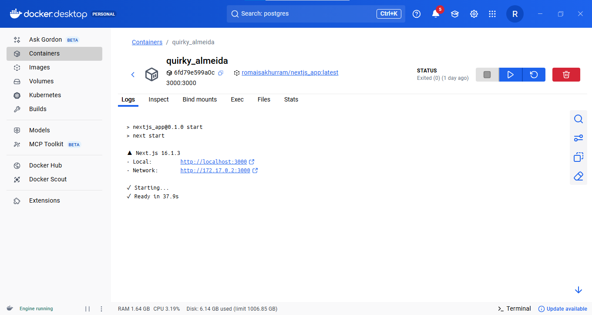
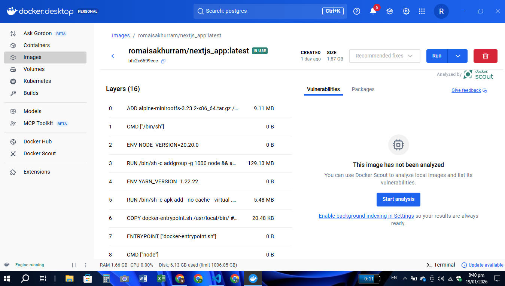

# Daily Mood Tracker

A visually appealing and responsive mood tracking application built with Next.js and TypeScript. Fully containerized with Docker for easy deployment.

## Images



## Features

- **Mood Selection**: Choose from three mood options (Happy 😊, Sad 😢, Neutral 😐)
- **Today's Mood Display**: Shows your selected mood for the current day prominently
- **Mood History**: View your past mood entries with dates and optional notes
- **Weekly Mood Overview**: Visual chart showing mood trends over the past 7 days
- **Mood Notes**: Add personal notes to each mood entry
- **Dark Mode**: Toggle between light and dark themes
- **Clear History**: Option to clear all mood history
- **Responsive Design**: Works seamlessly on mobile, tablet, and desktop
- **Persistent Storage**: Data saved in browser's localStorage

## Technical Implementation

- Built with Next.js 16.1.3 and React 19.2.3
- TypeScript for type safety
- Tailwind CSS for styling with a calm, wellness-focused color palette
- React hooks for state management
- Browser localStorage for data persistence
- Docker containerization for consistent deployment

## UI/UX Highlights

- Clean, magazine-style layout with soft pastel colors
- Subtle animations and hover effects
- Rounded cards with gentle shadows
- Calm and friendly color palette
- Smooth transitions for all interactions
- Touch-friendly interface for mobile devices

### Prerequisites

- Node.js (v16 or later)
- Docker (for containerized deployment)

### Local Development

1. Clone the repository
2. Install dependencies: `npm install`
3. Run the development server: `npm run dev`
4. Visit `http://localhost:3000` in your browser

### Docker Deployment

1. Build the Docker image: `docker build -t mood-tracker .`
2. Run the container: `docker run -p 3000:3000 mood-tracker`
3. Visit `http://localhost:3000` in your browser

## Project Structure

```
app/
  └── page.tsx        # Main mood tracker component
Dockerfile            # Container configuration
README.md             # Project documentation
package.json          # Dependencies and scripts
```

## License

This project is open source and available under the MIT License.
